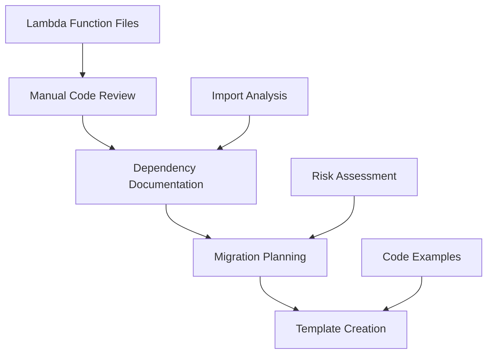

# Design Document

## Overview

This design outlines a simple, manual approach for Project 07: Lambda Function Assessment & Planning. Given the small codebase (4 Lambda functions), we'll use manual analysis with simple documentation tools rather than building complex automated systems.

## Architecture

### Simple Manual Assessment Approach



### Assessment Process

1. **Manual Code Review**: Read each Lambda function and document its purpose and complexity
2. **Dependency Documentation**: List imports and map to modern equivalents
3. **Migration Planning**: Create simple migration order and approach
4. **Template Creation**: Provide before/after examples for common patterns

## Components and Interfaces

### Simple Documentation Structure

```python
class LambdaAssessment:
    """Simple data structure for Lambda function assessment."""

    file_path: str
    handler_name: str
    purpose: str
    current_imports: List[str]
    legacy_dependencies: List[str]
    modern_equivalents: Dict[str, str]
    migration_complexity: str  # "LOW", "MEDIUM", "HIGH"
    migration_notes: str

class MigrationPlan:
    """Simple migration plan for all Lambda functions."""

    migration_order: List[str]
    common_patterns: Dict[str, str]
    testing_approach: str
    rollback_strategy: str
```

## Data Models

### Assessment Documentation

Simple markdown documents and JSON files to capture assessment results:

1. **`lambda-inventory.md`** - Manual documentation of each Lambda function
2. **`dependency-mapping.json`** - Simple mapping of legacy to modern components
3. **`migration-plan.md`** - Step-by-step migration approach
4. **`testing-templates/`** - Directory with before/after code examples

## Error Handling

Since this is a manual assessment process, error handling is minimal:

1. **Manual Review**: All analysis is done through manual code review
2. **Documentation Validation**: Ensure all Lambda functions are documented
3. **Template Validation**: Verify migration templates compile and run

## Testing Strategy

### Comprehensive Lambda Testing Framework

1. **Unit Testing**: Test Lambda handlers with mocked dependencies using `IrusContainer.create_unit()`
2. **Integration Testing**: Test with real AWS resources using `IrusContainer.create_integration()`
3. **Discord Event Testing**: Comprehensive fixtures for all Discord command scenarios
4. **Environment Management**: Proper handling of environment variables and import timing
5. **Template Validation**: Ensure migration templates compile, run, and follow modern patterns
6. **Documentation Review**: Validate assessment documentation is complete and accurate

### Testing Infrastructure Requirements

- **Container Management**: Sophisticated setup for both unit and integration test containers
- **Test Data Isolation**: Use 99DDHHMM pattern and unique identifiers to prevent conflicts
- **Environment Variable Handling**: Patch environment before Lambda handler imports
- **Directory Structure**: Avoid Python keyword conflicts in test directory naming

## Implementation Phases

### Phase 1: Manual Lambda Review (Days 1-2)
- Read and document each of the 4 Lambda functions
- Identify current imports and dependencies
- Assess complexity and migration effort

### Phase 2: Migration Planning (Days 2-3)
- Map legacy dependencies to modern equivalents
- Create migration order and approach
- Design comprehensive testing strategy for Lambda functions
- Address Python keyword conflicts and import issues
- Design container management patterns for testing

### Phase 3: Documentation and Templates (Days 3-5)
- Create migration templates and examples
- Document findings and recommendations
- Update steering docs with Lambda patterns

## Integration Points

### Modern Architecture Integration

Based on dependency analysis, the Lambda modernization requires significant service layer expansion:

#### Critical Missing Services Identified
1. **DiscordCommandService** - Handle complex command parsing and routing (Bot Lambda)
2. **InvasionWorkflowService** - Coordinate invasion creation and file processing workflows
3. **ReportGenerationService** - Consolidate report generation logic across multiple Lambdas
4. **LadderExtractionService** - OCR and ladder data extraction from images (Process Lambda)
5. **FileManagementService** - Discord file downloads and S3 operations (Process Lambda)

#### Existing Services to Leverage
1. **ImageProcessingService** - Image preprocessing for OCR (already implemented)
2. **DiscordMessagingService** - Discord webhook posting (already implemented)
3. **MemberManagementService** - Member-related business logic (already implemented)

#### Service Integration Strategy
- **Bot Lambda**: Requires 3 new services (DiscordCommand, InvasionWorkflow, ReportGeneration)
- **Process Lambda**: Requires 2 new services (LadderExtraction, FileManagement)
- **Invasion Lambda**: Requires 1 new service (ReportGeneration)
- **Month Lambda**: No new services needed (already modern)

### Architecture Integration Patterns

The assessment tool will integrate with existing modern architecture:

1. **Container Pattern**: Use `IrusContainer` for dependency injection in assessment tools
2. **Repository Pattern**: Reference existing repositories when mapping dependencies
3. **Service Pattern**: Map Lambda business logic to appropriate services
4. **Testing Pattern**: Leverage existing testing infrastructure for validation

### Documentation Integration

Assessment results will integrate with existing project documentation:

1. **Steering Docs**: Add Lambda-specific patterns to steering documentation
2. **Project Docs**: Update project roadmap with detailed migration plans
3. **Code Comments**: Add migration guidance directly to Lambda function files
4. **README Updates**: Update development workflow documentation

## Success Criteria

### Functional Success Criteria
- [ ] Complete inventory of all Lambda functions with accurate metadata
- [ ] Accurate dependency classification and mapping to modern services
- [ ] Risk assessment that correctly identifies high-risk migrations
- [ ] Migration templates that produce working modernized Lambda code
- [ ] Comprehensive documentation enabling team execution

### Quality Success Criteria
- [ ] Assessment tool has >90% test coverage
- [ ] Migration templates validated against existing Lambda functions
- [ ] Risk assessment validated through manual review
- [ ] Documentation follows established steering doc patterns
- [ ] Integration with existing modern architecture patterns
- [ ] Testing framework handles environment variables and import timing correctly
- [ ] Python keyword conflicts resolved throughout codebase
- [ ] Container management patterns work for both unit and integration tests

### Performance Success Criteria
- [ ] Assessment completes within reasonable time (<30 minutes for full codebase)
- [ ] Generated migration templates are efficient and follow best practices
- [ ] Assessment tool can be re-run as codebase evolves
