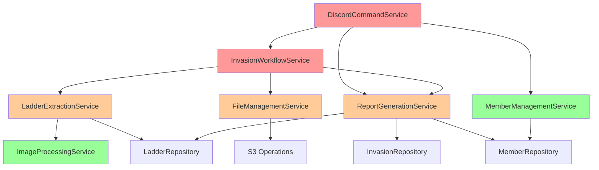

# Missing Service Interface Designs

## Overview

This document defines the interface designs for the 5 missing services identified in the Lambda dependency analysis. These services are required to modernize the Lambda functions and eliminate legacy facade dependencies.

## Service Interface Specifications

### 1. ReportGenerationService

**Purpose**: Consolidate report generation logic across multiple Lambda functions
**Priority**: HIGH - Required by Invasion Lambda (first migration target)
**Complexity**: MEDIUM

#### Interface Definition

```python
from typing import Optional, Dict, Any, List
from ..container import IrusContainer
from ..models.invasion import IrusInvasion
from ..models.member import IrusMember
from ..repositories.invasion import InvasionRepository
from ..repositories.ladder import LadderRepository
from ..repositories.member import MemberRepository

class ReportGenerationService:
    """Service for generating various types of reports from invasion and member data."""

    def __init__(self, container: Optional[IrusContainer] = None):
        """Initialize service with dependency injection.

        Args:
            container: Dependency injection container. Uses default if None.
        """
        self._container = container or IrusContainer.default()
        self._logger = self._container.logger()
        self._invasion_repo = InvasionRepository(self._container)
        self._ladder_repo = LadderRepository(self._container)
        self._member_repo = MemberRepository(self._container)

    def generate_invasion_report(self, invasion_name: str) -> Dict[str, Any]:
        """Generate comprehensive invasion report with statistics.

        Args:
            invasion_name: Name of invasion (e.g., "20240315-bw")

        Returns:
            Dictionary containing:
            - invasion_data: Basic invasion information
            - member_count: Total members who participated
            - contiguous_ranks: Number of contiguous ranks from top
            - ladder_data: Processed ladder information
            - statistics: Calculated invasion statistics

        Raises:
            ValueError: If invasion not found or invalid
            RepositoryError: If database operations fail
        """

    def generate_monthly_report(self, year: int, month: int) -> Dict[str, Any]:
        """Generate monthly aggregated report for all invasions.

        Args:
            year: Year (e.g., 2024)
            month: Month (1-12)

        Returns:
            Dictionary containing:
            - month_summary: Basic month information
            - invasion_list: List of invasions in the month
            - aggregated_stats: Combined statistics
            - member_participation: Member participation summary

        Raises:
            ValueError: If invalid date parameters
            RepositoryError: If database operations fail
        """

    def generate_member_report(self, player: str) -> Dict[str, Any]:
        """Generate individual member participation report.

        Args:
            player: Player name

        Returns:
            Dictionary containing:
            - member_data: Basic member information
            - invasion_history: List of invasions participated in
            - statistics: Member performance statistics
            - rank_progression: Rank changes over time

        Raises:
            ValueError: If member not found
            RepositoryError: If database operations fail
        """

    def store_report_to_s3(self, report_data: Dict[str, Any], report_type: str, identifier: str) -> str:
        """Store generated report to S3 for caching and retrieval.

        Args:
            report_data: Generated report data
            report_type: Type of report ("invasion", "monthly", "member")
            identifier: Unique identifier for the report

        Returns:
            S3 key where report was stored

        Raises:
            ClientError: If S3 operations fail
        """

    def calculate_invasion_statistics(self, invasion_name: str) -> Dict[str, Any]:
        """Calculate detailed statistics for an invasion.

        Args:
            invasion_name: Name of invasion

        Returns:
            Dictionary with calculated statistics
        """

    def format_report_for_discord(self, report_data: Dict[str, Any], report_type: str) -> List[str]:
        """Format report data for Discord display with proper line breaks.

        Args:
            report_data: Generated report data
            report_type: Type of report for formatting

        Returns:
            List of formatted strings ready for Discord posting
        """
```

#### Dependencies and Integration Points

**Repository Dependencies:**
- `InvasionRepository` - Access invasion data
- `LadderRepository` - Access ladder and rank data
- `MemberRepository` - Access member information

**Container Dependencies:**
- `logger()` - Logging operations
- `s3()` - Report storage operations
- `bucket_name()` - S3 bucket configuration

**Integration with Existing Services:**
- Uses existing repository pattern for data access
- Integrates with `DiscordMessagingService` for report posting
- Leverages `IrusContainer` for dependency injection

---

### 2. LadderExtractionService

**Purpose**: OCR and ladder data extraction from invasion screenshots
**Priority**: HIGH - Required by Process Lambda
**Complexity**: HIGH

#### Interface Definition

```python
from typing import Optional, Dict, Any, List, Tuple
from ..container import IrusContainer
from ..models.ladder import IrusLadder
from ..models.member import IrusMember
from ..services.image_processing import ImageProcessingService
from ..repositories.ladder import LadderRepository
from ..repositories.member import MemberRepository

class LadderExtractionService:
    """Service for extracting ladder data from invasion screenshots using OCR."""

    def __init__(self, container: Optional[IrusContainer] = None):
        """Initialize service with dependency injection.

        Args:
            container: Dependency injection container. Uses default if None.
        """
        self._container = container or IrusContainer.default()
        self._logger = self._container.logger()
        self._textract = self._container.textract()
        self._s3 = self._container.s3()
        self._bucket_name = self._container.bucket_name()
        self._image_service = ImageProcessingService(self._container)
        self._ladder_repo = LadderRepository(self._container)
        self._member_repo = MemberRepository(self._container)

    def extract_ladder_from_image(self, image_data: bytes, invasion_name: str) -> IrusLadder:
        """Extract ladder data from invasion screenshot using OCR.

        Args:
            image_data: Raw image bytes
            invasion_name: Name of invasion for context

        Returns:
            IrusLadder instance with extracted data

        Raises:
            ExtractionError: If OCR fails or data is invalid
            ValidationError: If extracted data doesn't match expected format
        """

    def extract_roster_from_image(self, image_data: bytes, invasion_name: str) -> IrusLadder:
        """Extract roster data from company roster screenshot.

        Args:
            image_data: Raw image bytes
            invasion_name: Name of invasion for context

        Returns:
            IrusLadder instance with roster data

        Raises:
            ExtractionError: If OCR fails or data is invalid
            ValidationError: If extracted data doesn't match expected format
        """

    def validate_extracted_data(self, ladder: IrusLadder, member_list: List[IrusMember]) -> Tuple[bool, List[str]]:
        """Validate extracted ladder data against known member list.

        Args:
            ladder: Extracted ladder data
            member_list: Known company members for validation

        Returns:
            Tuple of (is_valid, list_of_validation_errors)
        """

    def handle_extraction_errors(self, error: Exception, image_data: bytes, context: Dict[str, Any]) -> Dict[str, Any]:
        """Handle OCR extraction errors with fallback strategies.

        Args:
            error: Original extraction error
            image_data: Image that failed processing
            context: Additional context for error handling

        Returns:
            Dictionary with error details and suggested actions
        """

    def preprocess_image_for_ocr(self, image_data: bytes) -> bytes:
        """Preprocess image to improve OCR accuracy.

        Args:
            image_data: Raw image bytes

        Returns:
            Preprocessed image bytes optimized for OCR
        """

    def parse_textract_response(self, textract_response: Dict[str, Any], extraction_type: str) -> Dict[str, Any]:
        """Parse AWS Textract response into structured ladder data.

        Args:
            textract_response: Raw Textract API response
            extraction_type: Type of extraction ("ladder" or "roster")

        Returns:
            Structured data dictionary
        """

    def retry_extraction_with_fallback(self, image_data: bytes, invasion_name: str, max_retries: int = 3) -> IrusLadder:
        """Retry extraction with different preprocessing strategies.

        Args:
            image_data: Raw image bytes
            invasion_name: Name of invasion
            max_retries: Maximum number of retry attempts

        Returns:
            IrusLadder instance or raises exception if all retries fail
        """
```

#### Dependencies and Integration Points

**AWS Service Dependencies:**
- `textract()` - AWS Textract for OCR processing
- `s3()` - Image storage and retrieval

**Service Dependencies:**
- `ImageProcessingService` - Image preprocessing for better OCR

**Repository Dependencies:**
- `LadderRepository` - Store extracted ladder data
- `MemberRepository` - Validate against known members

**Container Dependencies:**
- `logger()` - Logging operations
- `bucket_name()` - S3 configuration

---

### 3. FileManagementService

**Purpose**: Discord file downloads and S3 operations
**Priority**: HIGH - Required by Process Lambda
**Complexity**: MEDIUM

#### Interface Definition

```python
from typing import Optional, Dict, Any, List, Tuple
import urllib3
from ..container import IrusContainer

class FileManagementService:
    """Service for managing file downloads from Discord and uploads to S3."""

    def __init__(self, container: Optional[IrusContainer] = None):
        """Initialize service with dependency injection.

        Args:
            container: Dependency injection container. Uses default if None.
        """
        self._container = container or IrusContainer.default()
        self._logger = self._container.logger()
        self._s3 = self._container.s3()
        self._bucket_name = self._container.bucket_name()
        self._pool_manager = urllib3.PoolManager()

    def download_discord_file(self, url: str, timeout: int = 30) -> bytes:
        """Download file from Discord CDN with proper error handling.

        Args:
            url: Discord file URL
            timeout: Request timeout in seconds

        Returns:
            File data as bytes

        Raises:
            DownloadError: If download fails or times out
            ValidationError: If file type is not supported
        """

    def upload_to_s3(self, file_data: bytes, key: str, content_type: Optional[str] = None) -> str:
        """Upload file data to S3 with retry logic.

        Args:
            file_data: File bytes to upload
            key: S3 key for the file
            content_type: MIME type (auto-detected if None)

        Returns:
            S3 URL of uploaded file

        Raises:
            UploadError: If S3 upload fails
        """

    def validate_file_type(self, file_data: bytes, allowed_types: Optional[List[str]] = None) -> Tuple[bool, str]:
        """Validate file type and size constraints.

        Args:
            file_data: File bytes to validate
            allowed_types: List of allowed MIME types (defaults to images)

        Returns:
            Tuple of (is_valid, detected_mime_type)
        """

    def handle_download_errors(self, url: str, error: Exception) -> Dict[str, Any]:
        """Handle download errors with appropriate retry strategies.

        Args:
            url: URL that failed to download
            error: Original download error

        Returns:
            Dictionary with error details and retry recommendations
        """

    def download_and_upload_workflow(self, discord_url: str, s3_key: str) -> str:
        """Complete workflow: download from Discord and upload to S3.

        Args:
            discord_url: Discord file URL
            s3_key: Target S3 key

        Returns:
            S3 URL of uploaded file

        Raises:
            WorkflowError: If any step in the workflow fails
        """

    def get_file_metadata(self, file_data: bytes) -> Dict[str, Any]:
        """Extract metadata from file data.

        Args:
            file_data: File bytes

        Returns:
            Dictionary with file metadata (size, type, dimensions if image)
        """

    def cleanup_temp_files(self, s3_keys: List[str]) -> Dict[str, bool]:
        """Clean up temporary files from S3.

        Args:
            s3_keys: List of S3 keys to delete

        Returns:
            Dictionary mapping keys to deletion success status
        """
```

#### Dependencies and Integration Points

**HTTP Dependencies:**
- `urllib3.PoolManager` - HTTP client for Discord downloads

**AWS Service Dependencies:**
- `s3()` - S3 operations for file storage

**Container Dependencies:**
- `logger()` - Logging operations
- `bucket_name()` - S3 configuration

**Integration Points:**
- Works with `LadderExtractionService` for image processing workflows
- Integrates with existing S3 patterns in the codebase

---

### 4. DiscordCommandService

**Purpose**: Discord command parsing and routing
**Priority**: MEDIUM - Required by Bot Lambda (last migration)
**Complexity**: HIGH

#### Interface Definition

```python
from typing import Optional, Dict, Any, List, Callable
from dataclasses import dataclass
from ..container import IrusContainer

@dataclass
class CommandRequest:
    """Structured representation of a Discord command request."""
    command: str
    subcommand: Optional[str]
    parameters: Dict[str, Any]
    user_id: str
    channel_id: str
    guild_id: str
    token: str
    raw_event: Dict[str, Any]

@dataclass
class CommandResponse:
    """Structured representation of a command response."""
    success: bool
    message: Optional[str]
    data: Optional[Dict[str, Any]]
    error: Optional[str]
    requires_followup: bool = False

class DiscordCommandService:
    """Service for parsing and routing Discord slash commands."""

    def __init__(self, container: Optional[IrusContainer] = None):
        """Initialize service with dependency injection.

        Args:
            container: Dependency injection container. Uses default if None.
        """
        self._container = container or IrusContainer.default()
        self._logger = self._container.logger()
        self._command_handlers: Dict[str, Callable] = {}
        self._permission_checker: Optional[Callable] = None

    def parse_command(self, discord_event: Dict[str, Any]) -> CommandRequest:
        """Parse Discord interaction event into structured command request.

        Args:
            discord_event: Raw Discord interaction event

        Returns:
            Structured CommandRequest object

        Raises:
            ParseError: If event format is invalid
        """

    def route_command(self, command: CommandRequest) -> CommandResponse:
        """Route command to appropriate handler based on command and subcommand.

        Args:
            command: Parsed command request

        Returns:
            Command response from handler

        Raises:
            CommandError: If command is not found or handler fails
        """

    def register_command_handler(self, command: str, subcommand: Optional[str], handler: Callable) -> None:
        """Register a handler function for a specific command/subcommand combination.

        Args:
            command: Main command name (e.g., "irus")
            subcommand: Subcommand name (e.g., "invasion", "member")
            handler: Function to handle the command
        """

    def validate_permissions(self, user_id: str, command: str, subcommand: Optional[str] = None) -> bool:
        """Validate user permissions for command execution.

        Args:
            user_id: Discord user ID
            command: Command name
            subcommand: Subcommand name if applicable

        Returns:
            True if user has permission, False otherwise
        """

    def format_response(self, result: Dict[str, Any], response_type: str = "message") -> Dict[str, Any]:
        """Format command result for Discord API response.

        Args:
            result: Command execution result
            response_type: Type of response ("message", "deferred", "modal")

        Returns:
            Discord API compatible response dictionary
        """

    def handle_command_error(self, error: Exception, command: CommandRequest) -> CommandResponse:
        """Handle command execution errors with appropriate user feedback.

        Args:
            error: Exception that occurred during command execution
            command: Original command request

        Returns:
            Error response for user
        """

    def extract_command_parameters(self, discord_options: List[Dict[str, Any]]) -> Dict[str, Any]:
        """Extract and validate command parameters from Discord options.

        Args:
            discord_options: List of Discord command options

        Returns:
            Dictionary of parameter name to value mappings
        """

    def set_permission_checker(self, checker: Callable[[str, str, Optional[str]], bool]) -> None:
        """Set custom permission checking function.

        Args:
            checker: Function that takes (user_id, command, subcommand) and returns bool
        """
```

#### Dependencies and Integration Points

**Service Dependencies:**
- All other services (for command execution)
- `MemberManagementService` - Member operations
- `ReportGenerationService` - Report commands
- `InvasionWorkflowService` - Invasion operations

**Container Dependencies:**
- `logger()` - Logging operations

**Integration Points:**
- Central routing hub for all Discord commands
- Coordinates with all other services based on command type
- Integrates with Discord API response format requirements

---

### 5. InvasionWorkflowService

**Purpose**: Coordinate invasion creation and processing workflows
**Priority**: MEDIUM - Required by Bot Lambda
**Complexity**: HIGH

#### Interface Definition

```python
from typing import Optional, Dict, Any, List
from dataclasses import dataclass
from enum import Enum
from ..container import IrusContainer
from ..repositories.invasion import InvasionRepository
from .ladder_extraction import LadderExtractionService
from .file_management import FileManagementService
from .report_generation import ReportGenerationService

class WorkflowStatus(Enum):
    """Workflow execution status."""
    PENDING = "pending"
    IN_PROGRESS = "in_progress"
    COMPLETED = "completed"
    FAILED = "failed"
    CANCELLED = "cancelled"

@dataclass
class WorkflowResult:
    """Result of workflow execution."""
    status: WorkflowStatus
    invasion_name: str
    message: str
    data: Optional[Dict[str, Any]] = None
    error: Optional[str] = None

@dataclass
class ProcessingResult:
    """Result of file processing workflow."""
    success: bool
    processed_files: List[str]
    failed_files: List[str]
    extraction_results: Dict[str, Any]
    error_details: Optional[Dict[str, Any]] = None

class InvasionWorkflowService:
    """Service for orchestrating invasion creation and processing workflows."""

    def __init__(self, container: Optional[IrusContainer] = None):
        """Initialize service with dependency injection.

        Args:
            container: Dependency injection container. Uses default if None.
        """
        self._container = container or IrusContainer.default()
        self._logger = self._container.logger()
        self._state_machine = self._container.state_machine()
        self._invasion_repo = InvasionRepository(self._container)
        self._ladder_service = LadderExtractionService(self._container)
        self._file_service = FileManagementService(self._container)
        self._report_service = ReportGenerationService(self._container)

    def create_invasion_workflow(self, invasion_data: Dict[str, Any]) -> WorkflowResult:
        """Execute complete invasion creation workflow.

        Args:
            invasion_data: Dictionary containing:
                - day, month, year: Date components
                - settlement: Settlement code
                - win: Boolean win status
                - notes: Optional notes

        Returns:
            WorkflowResult with creation status and details

        Raises:
            WorkflowError: If workflow execution fails
        """

    def process_invasion_files(self, invasion_name: str, file_urls: List[str]) -> ProcessingResult:
        """Process uploaded files for an invasion (screenshots, rosters).

        Args:
            invasion_name: Name of invasion
            file_urls: List of Discord file URLs to process

        Returns:
            ProcessingResult with file processing status

        Raises:
            ProcessingError: If file processing fails
        """

    def coordinate_step_functions(self, workflow_data: Dict[str, Any]) -> Dict[str, Any]:
        """Coordinate with AWS Step Functions for complex workflows.

        Args:
            workflow_data: Data for step function execution

        Returns:
            Step function execution result

        Raises:
            StepFunctionError: If step function execution fails
        """

    def handle_workflow_errors(self, error: Exception, context: Dict[str, Any]) -> WorkflowResult:
        """Handle workflow errors with appropriate recovery strategies.

        Args:
            error: Exception that occurred during workflow
            context: Workflow context for error handling

        Returns:
            WorkflowResult with error details and recovery actions
        """

    def validate_invasion_data(self, invasion_data: Dict[str, Any]) -> Tuple[bool, List[str]]:
        """Validate invasion data before workflow execution.

        Args:
            invasion_data: Invasion data to validate

        Returns:
            Tuple of (is_valid, list_of_validation_errors)
        """

    def check_invasion_conflicts(self, invasion_name: str) -> Tuple[bool, Optional[str]]:
        """Check for existing invasions that might conflict.

        Args:
            invasion_name: Proposed invasion name

        Returns:
            Tuple of (has_conflict, conflict_description)
        """

    def execute_post_creation_tasks(self, invasion_name: str) -> Dict[str, Any]:
        """Execute tasks that run after invasion creation (notifications, reports).

        Args:
            invasion_name: Name of created invasion

        Returns:
            Dictionary with task execution results
        """

    def rollback_invasion_creation(self, invasion_name: str, reason: str) -> bool:
        """Rollback invasion creation in case of errors.

        Args:
            invasion_name: Name of invasion to rollback
            reason: Reason for rollback

        Returns:
            True if rollback successful, False otherwise
        """
```

#### Dependencies and Integration Points

**Service Dependencies:**
- `LadderExtractionService` - Process invasion screenshots
- `FileManagementService` - Handle file downloads and uploads
- `ReportGenerationService` - Generate invasion reports

**Repository Dependencies:**
- `InvasionRepository` - Invasion data operations

**AWS Service Dependencies:**
- `state_machine()` - Step Functions coordination

**Container Dependencies:**
- `logger()` - Logging operations

**Integration Points:**
- Orchestrates multiple services for complex workflows
- Integrates with AWS Step Functions for long-running processes
- Coordinates with Discord API for user feedback

## Service Integration Architecture

### Dependency Graph



**Legend:**
- Red: High complexity services (new)
- Orange: Medium complexity services (new)
- Green: Existing services/repositories

### Service Layer Integration Points

#### Container Pattern Integration
All services follow the established `IrusContainer` pattern:
- Constructor accepts optional container parameter
- Uses `IrusContainer.default()` if none provided
- Accesses dependencies through container methods

#### Repository Integration
Services use existing repositories for data access:
- `MemberRepository` - Member data operations
- `InvasionRepository` - Invasion data operations
- `LadderRepository` - Ladder and rank data operations

#### AWS Service Integration
Services integrate with AWS through container:
- `s3()` - S3 operations for file storage
- `textract()` - OCR processing
- `state_machine()` - Step Functions coordination
- `logger()` - CloudWatch logging

#### Error Handling Integration
All services follow established error handling patterns:
- Convert AWS exceptions to domain exceptions
- Provide detailed error context and logging
- Support retry mechanisms where appropriate

## Implementation Notes

### Service Development Order
1. **ReportGenerationService** - Foundation for other services
2. **FileManagementService** - Required by LadderExtractionService
3. **LadderExtractionService** - Complex OCR processing
4. **DiscordCommandService** - Command routing infrastructure
5. **InvasionWorkflowService** - Orchestration of all services

### Testing Strategy
Each service requires comprehensive testing:
- **Unit Tests**: Mock all dependencies, test business logic
- **Integration Tests**: Real AWS resources, validate end-to-end workflows
- **Performance Tests**: Ensure services meet performance requirements

### Documentation Requirements
Each service needs:
- Interface documentation with examples
- Integration guide with other services
- Error handling and troubleshooting guide
- Performance characteristics and limitations
