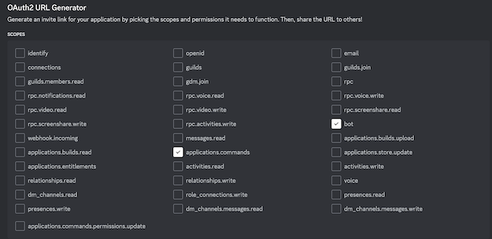

# New World Invasion Stats

Our company on Delos runs PvE invasions for other companies that may focus on PvP, or have other events that clash at the same time. We charge those companies a fee if we win the invasion, which is paid as a salary and prizes to those company members that participate.

This discord bot will extract the invasion statistics from ladder screen shots collected at the end of an invasion. It can then produce reports on an invasion and a monthly report summarising all the invasions the company was contracted to support. This saves the company time to manually enter and track this information.

The backend for this bot is deployed in AWS. By using a new Free Tier account, this bot will cost only a few dollars each month, depending on how many invasion screen shots are uploaded.

In this example, the slash command is called `/irus` when stands for *Invasions R Us*.

# Instructions

*Here is an example of the instructions given to the admins in our New World company:*

In the #general you can access the `/irus` commands to add/remove members, upload ladder screenshots from invasions, and generate member, invasion and monthly reports.

Type `/irus` to see the latest set of commands and a brief description. Some commands have mandatory fields, some have optional fields as well. Where optional fields include dates, this commands will default to today's date if another is not specified.

## Membership

By tracking membership the bot can then report on members participation in invasions.
- `/irus member add` to add a new member or update a member. You must get the player name exactly the same, including case. The command will also update the player's member in invasions on or after the starting date.
- `/irus member remove` to remove a member who has left the company.
- `/irus member list` will generate a CSV of all the current members to download from a link.

## Invasions

At the completion of an invasion you can upload screenshots of the ladder.
- `/irus invasion add` to register the invasion, including the settlement. This will output a name for the invasion that will be the *date-settlement*. You will need to use this name with other commands.
- `/irus invasion screenshots` to upload all 7 screenshots of the ladder in one command.
- `/irus invasion ladder` to upload a screenshot. Enter the invasion name  and drag the screenshot to upload it. Use the up arrow to repeat this command until all the screenshots are loaded, typically 7 times.


- `/irus invasion list` will list all the registered invasions for the given month, defaulting to this month.


## Reports

Most reports are generated when you run this command, and if provided as a CSV you will need to click a link to download the file.
- `/irus report invasion` to get the stats from a specific invasion, including which members attended, as a CSV that can be downloaded from the link provided.


Sample downloaded report:


- `/irus report month` to generate a report across all the invasions for a given month, defaulting to this month, as a CSV that can be downloaded from the link provided.


Sample downloaded report:


- `/irus report member` to get a report about a specific member this month. Run after running `/irus report month` to get the latest results.


---

# Bot Installation

## Dependencies

- Python 3.12
- Python [virtualenv](https://virtualenv.pypa.io/en/latest/) or equivalent
- [AWS CLI v2](https://docs.aws.amazon.com/cli/latest/userguide/getting-started-install.html)
- [AWS SAM](https://docs.aws.amazon.com/serverless-application-model/latest/developerguide/install-sam-cli.html)
- Docker

## Create AWS Account

Navigate to https://aws.amazon.com/free and create an AWS Free Tier account. You will still incurr some charges using this account, so I strongly recommend you create a **Billing and Cost Management** -> **Budget** to alert you if the costs are higher than you expect.

## Enable Organizations

Navigate to AWS Organizations and enable for this account.

## Enable Identity Centre

While still in AWS Organizations, under services enable Identity Centre.
Navigate to Identity Centre and create
- Permissions Set for AdministratorAccess
- Group called `admins`
- A user, adding them to the `admins` group. Setup the user's password and MFA.
- AWS Accounts add this account and enable the group `admins`
- Test that your user can login to this account

## Enable CLI SSO

- [Create a profile using SSO](https://docs.aws.amazon.com/cli/latest/userguide/cli-configure-sso.html#cli-configure-sso-configure)

```bash
aws configure sso
SSO session name (Recommended): irus-202410
SSO start URL [None]: https://irus-202410.awsapps.com/start
SSO region [None]: us-east-1
SSO registration scopes [None]: sso:account:access
```

This will force you to login as your user through Identity Centre to enable the AWS CLI access to this account.

If your login expires and does not automatically refresh, run

```bash
aws sso login --profile irus-202410
```

## Create Bot

- Navigate to https://discord.com/developers/applications.
- Create a new application and provide a name

## Region, Store Keys and Tokens

Decide on what AWS Region you intend to use and switch the console to that region.

In your AWS account navigate to **Systems Manager** -> **Parameter Store**. This is a good and cost effective way of storing secrets and keys you can programmatically fetch.

Decide on a prefix for your parameters, for example `irus`, and create four **secure string** parameters under that prefix as we get these keys in the following steps:
1. `/irus/appid`
2. `/irus/bottoken`
3. `/irus/serverid`
4. `/irus/publickey`

In another tab navigate to https://discord.com/developers/applications and select the application you created. Under **General Information** you will see both the **Application Id** and the **Public Key**. Add these values to the parameters you created. 

Press **Save**.

Now navigate to **Bot** and obtain the **Bot Token**, and store that in the parameter store.

## Deploy Backend

Setup the python environment:

```bash
$ virtualenv venv
$ source venv/bin/activate
$ pip install -r requirements.txt
$ cd invasions
```

Review the [samconfig.toml](./samconfig.toml) file and make any changes for your account, including the **profile**.

Review the parameter defaults in [template.yaml](./template.yaml) file and adjust if needed.

Now use AWS SAM to deploy to your AWS account.

```bash
$ sam build
$ sam deploy
```


The outputs from the deploy will include the **InteractionsEndpointUrl** that is needed for the next step.

## Interactions Endpoint

The next step is to configure the API Gateway endpoint that you just installed so Discord knows where to send the commands.

Navigate to https://discord.com/developers/applications and select your application, then under **General Information** add the **InteractionsEndpointUrl** from the previous step to the **INTERACTIONS ENDPOINT URL** box and press **Save**. If the keys are all properly setup it should save.

## Server Installation

Navigate to https://discord.com/developers/applications and select your application, then under **OAuth2** tick *application.commands* and *bot*:



Another panel will appear, tick *Attach Files* and *Use Slash Commands*:


Copy the **GENERATED URL** and open that Url in another tab. Select your server where you want to run the bot.

## Configure serverid

Right click on the server icon in Discord and select `Copy Server ID`. Copy the ID into the `/irustest/serverid` SSM parameter.

## Register slash commands

The final step is to register the slash commands supported by the bot on your server. Review the [discord/commands.yaml](./discord/commands.yaml) and check the name matches the **DiscordCmd** parameter in the SAM template. The [discord/register.py](./discord/register.py) will fetch the keys it needs from the parameter store, so check the profile and parameter paths are correct before running:

```bash
$ cd discord
$ python3 register.py --register
```

If successful you should see a 20X return code.

You should now be able to run the slash commands on your server.

---

## Troubleshooting

Discord does not provide useful error messages if something goes wrong. Instead you should review the **CloudWatch Logs** for the **Bot** lambda function. The logs it generates are verbose and should help to identify the issue.

---

## Resources

Sites that have helped with the development of this bot:
- https://discord.com/developers/docs/interactions/receiving-and-responding
- https://docs.aws.amazon.com/textract/latest/dg/examples-export-table-csv.html
- https://gemisis.medium.com/building-a-serverless-discord-bot-on-aws-5dc7d972c9c6
    - https://github.com/GEMISIS/discord-bot-cdk-construct/
- https://betterprogramming.pub/build-a-discord-bot-with-aws-lambda-api-gateway-cc1cff750292
- https://github.com/ker0olos/aws-lambda-discord-bot
- https://stackoverflow.com/questions/51716821/discord-bot-using-aws-lambda